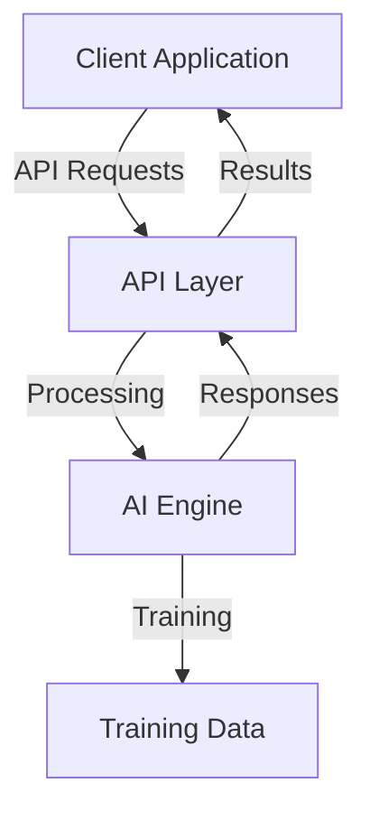

# System Architecture

## High-Level Overview

Doofus is built as a modern, scalable application with the following key components:

## Key Components

### Frontend Layer
- Next.js application
- React components for UI
- TailwindCSS for styling
- TypeScript for type safety

### API Layer
- Next.js API routes
- RESTful endpoints
- WebSocket support for real-time communication

### AI Engine
- Custom language models
- Training pipeline
- Real-time inference
- Memory management

### Data Storage
- Document storage
- Training data management
- User data and preferences
- Conversation history

## System Requirements

- Node.js 18+
- Modern web browser
- Sufficient RAM for model loading
- SSD storage recommended